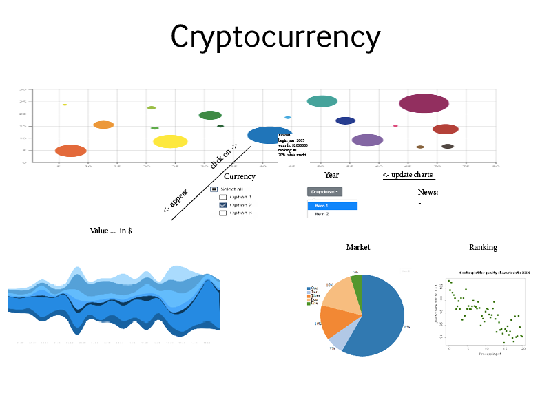

# Programmeer project - Cryptocurrency

## Introductie
Crypto currency wordt steeds groter en groter, maar er is eigelijk nog niet zo veel over bekend. Het is niet tastbaar en alleen onderling verhandelbaar, zonder tussenpersoon. Welke currencies bestaan er nou, is de markt wisselvallig of juist constant(stijgend?).

## Probleem
Er is veel data beschikbaar over crypto currency. Doordat er is geen tussenpersoon of verhandelaar die de markt overzichterlijk maakt, wordt de markt minder toegangekelijk voor nieuwe investeerder en handelaren.

## Oplossing
Het visualiseren van ontwikkelingen van crypto currency en specifieke informatie per currency, tussen 2013-2018.

## Website
+ Hele markt in bubbels van currencies weergeven, de grootte van de bubbel staat voor de grootte op de markt.(Bubbelchart)
+ Per currency een kleine infosheet(1) als de muis er op staat.
+ Uitgebreide infosheet(2) als er op een currency geklikt wordt.
Vanuit infosheet(2), kan er via dropdown menu's gewisselt worden tussen currencies en kan het jaar veranderd worden.
+ Vergelijken van meerdere currencies infosheet(2), weergeef dit voor geselecteerde currencies.

Infosheet(1):
+ Begin van currency
+ Huidige prijs usd
+ Huidige ranking
+ Omvang in de markt

Infosheet(2):
+ prijs usd (Stream graph)
+ Ranking (Scatter plot)
+ Recente nieuws koppen
+ Totale markt (Pie chart)

### Visual Sketch

## Main Features
+ Interactive bubble Bubbelchart(MVP)
Weergave van de totale markt, de grootte van de bubbel weergeeft de grootte op de markt.
+ Interactive Stream graph(MVP)
Weergeeft prijs in usd over tijd.
+ Interactive Scatter plot(MVP)
Weergeeft ranking over tijd.
+ Pie chart(Optional)
Weergave van totale markt
+ Checkbox(MVP)
Kies currencies om te vergelijken
+ Dropdown menu(MVP)
Kies jaar.
+ Slider(Optional)
Verschuiven van tijdspan
+ Nieuws
van vast gesteld moment, nieuws items
(Optional, actuele nieuws items)

## Prerequisites
### Data
[Every Cryptocurrency Daily Market Price](https://www.kaggle.com/jessevent/all-crypto-currencies/kernels). Dit de enige data die nodig is voor de visualisatie.

### external components
- [D3](https://d3js.org/)
- [D3-tip](https://github.com/Caged/d3-tip)
- [Atom](atom.io)

### Simular visualisation
Ctypto visualisatie kan je vinden op [Elementus](https://elementus.io/token-sales-history). Elementus, maakt gebruik van D3 en ajax, een slider en histogrammen ineen. In deze bewegende visualisatie kan je goed de groei van de cryptocurrency markt zien, maar verder geen details over de currencies.

### Hardest Parts
+ De informatie zo duidelijk mogelijk weergeven
+ Website design
+ Nieuws items interactief/up to date, api acces
