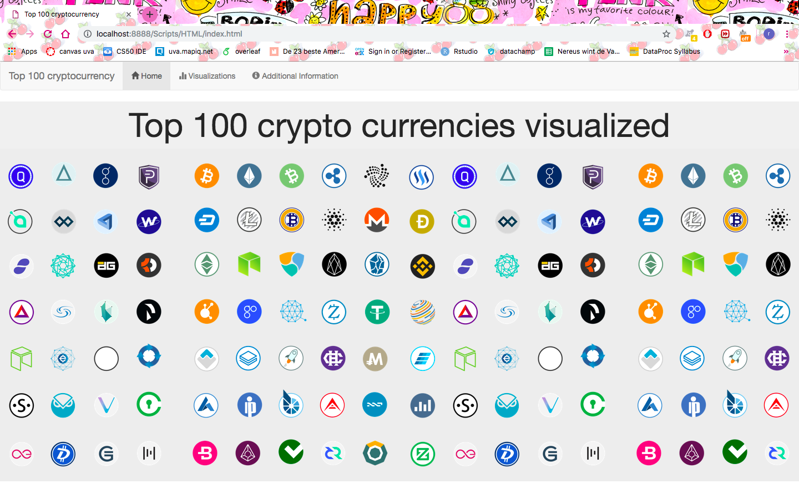
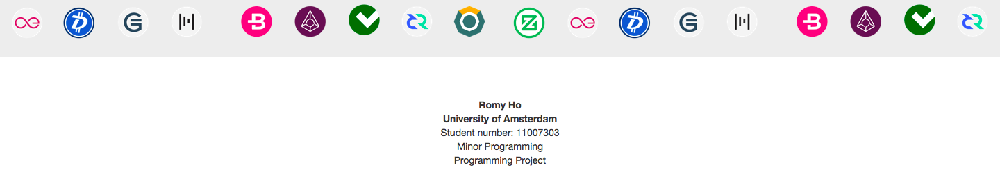
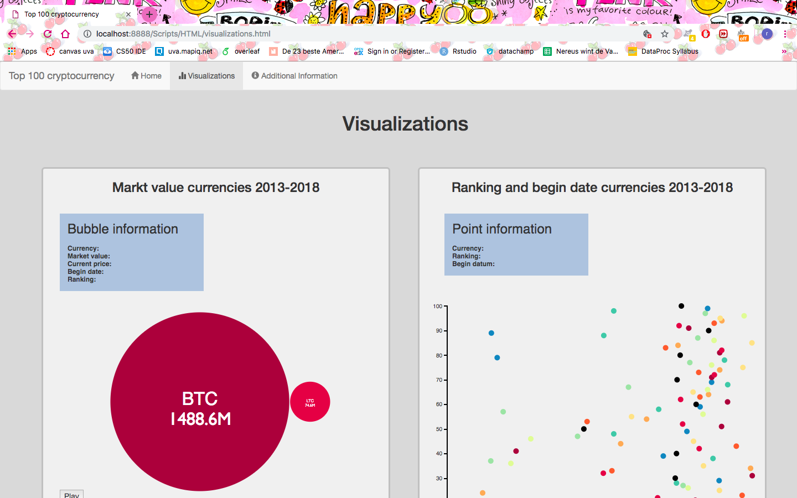
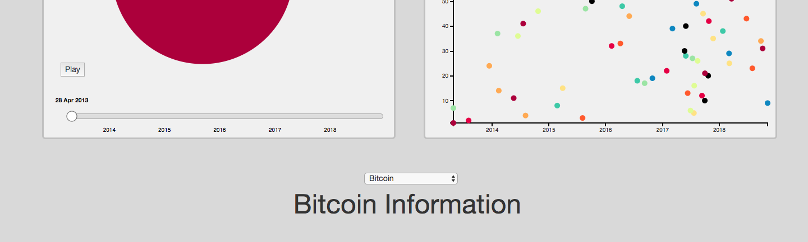
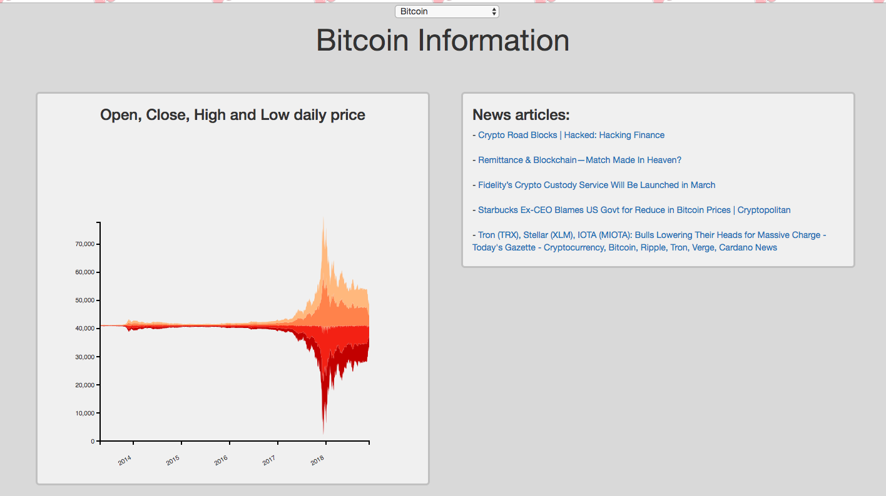
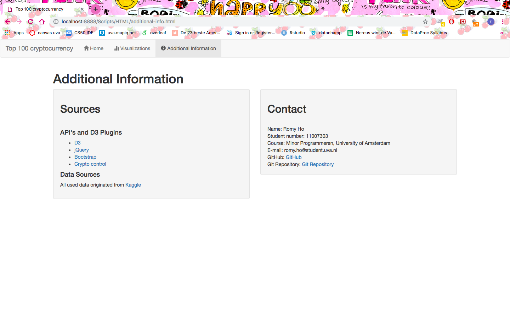

# Programmeer project - Top 100 cryptocurrency

Name: Romy Ho  
Student number: 11007303  
Minor Programming

## Introduction
Crypto currency is getting bigger, but there is not much information about it. It's not tangible and only mutually tradable, without a middleman. Which currencies exist and is the market changeable or constant. This website will contain visualizations to make cryptocurrency more accessible.

## Website

### homepage
Homepage with cryptocurrency logo's

This footer is at the end of the page, the same footer at visualizations.html

### visualization
The nav-bar, bubble and scatterplot.

The play/pauze slider and dropdown menu.

The Streamgraph and news items.

### additional information

## Sources
#### Data
Downloaded on 08-01-2019
[Every Cryptocurrency Daily Market Price](https://www.kaggle.com/jessevent/all-crypto-currencies/kernels)

## Code Sources

+ Bootstrap elements:
 + navigation bar: [nav-bar w3schools](https://www.w3schools.com/bootstrap/bootstrap_navbar.asp)
 + rows & columns:  [grid](https://getbootstrap.com/docs/4.2/examples/grid/)

+ Bubble chart:
  + The idea for a bubble chart:  [bubble](https://bl.ocks.org/alokkshukla/3d6be4be0ef9f6977ec6718b2916d168)
  + The idea for a play/pause time slider: [slider](https://bl.ocks.org/officeofjane/47d2b0bfeecfcb41d2212d06d095c763)
  [script](https://unpkg.com/d3-simple-slider/build/d3-simple-slider.js)

+ Scatter plot:
  + Used by Data processing: [scatter](http://bl.ocks.org/weiglemc/6185069)

+ Stream graph:
  + The idea for a streamgraph:  [stream](http://bl.ocks.org/WillTurman/4631136)

+ News articles:
  + API: [Crypto control](https://cryptocontrol.io/en/developers/apis)

+ Dropdown:
  + The idea for a dropdown: [dropdown](http://bl.ocks.org/williaster/10ef968ccfdc71c30ef8)

##### API's and D3 Plugins

+ [D3 V5](https://d3js.org/d3.v5.min.js)
+ [D3 V2](http://d3js.org/d3.v2.js)
+ [jQuery](https://ajax.googleapis.com/ajax/libs/jquery/3.3.1/jquery.min.js)
+ [Bootstrap](https://stackpath.bootstrapcdn.com/bootstrap/4.2.1/js/bootstrap.min.js)
+ [Cryptocontrol](https://cryptocontrol.io/en/developers/apis)
