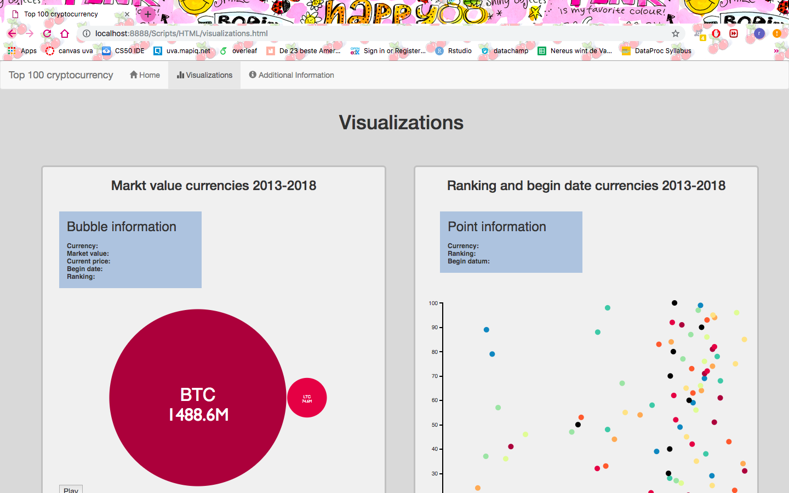
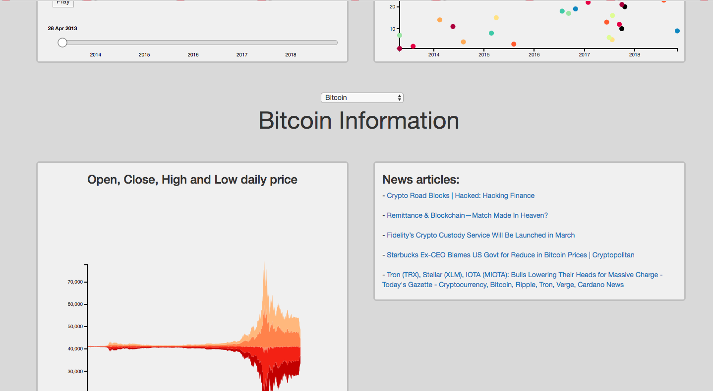
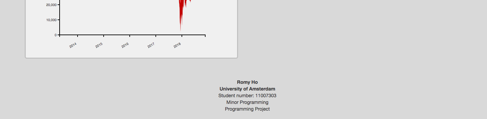

# Report - Programming Project - UvA
Name: Romy Ho 
Student number: 11007303  
Minor Programming

### Introduction
The top 100 cryptocurrency website, is created to make crypto more visual. The visualization page has 4 D3 linked elements. It shows currencies from 2013 until 2018, their market values, close, open rates etc. This information is visualized in a bubble chart, scatter plot and stream graph, the page has an latest news overview per currency.

### Visual design
The homepage has a navigation bar to change pages. Under the page there is a footer with personal information. The page contains a image of crypto currency logo's and a title. The next page at the navigation bar is the visualization page. This page contains 4 main elements, a bubble chart, a scatter plot, a stream graph and news articles links. It starts with the visualizations for all currencies, the bubble chart and scatterplot. Both have a tooltip with additional information about the bubbles or points. The bubble chart also has a time slider with a play function, that shows the growth of the crypto market over time. The bubble chart visualizes the market value of the currencies and the beginning of new currencies over time. The scatter plot visualizes the connexion between the beginning of the currency in the data and the current ranking. When clicked on one of the bubbles or points the window will show the second part of the page. This part contains a dropdown, title, stream graph and news article links. All will change for the chosen currency. The stream graph will show High, Low, Open and close rate for the dates of that currency. The news articles are selected for the chosen currency. 

### Technical design

##### Overview

The website consists of the following components:

+ A navigation bar, with 3 links.
+ 3 D3 visualizations, all with tooltip:
  + Bubble chart with on click and playbutton slider
  + Scatter plot witch on click
  + Stream graph
+ Dropdown menu
+ Footer

###### File and code structure

The github repository contains the maps: Data, Scripts and doc.

Doc contains the images used for the README, DESIGN and REPORT.

Data contains the csv file downloaded from: [kaggle](https://www.kaggle.com/jessevent/all-crypto-currencies/kernels) and the json files.
+ crypto-markets.csv
contains all needed data.
+ crypto-market.json
contains top 100 crypto currency data converted dictionary json file.
+ name_date.json
contains top 100 crypto currency names and start date according to the data.

Scripts contains maps:
- CSS
- HTML
- Javascript
- Python

CSS contains all styling for elements and html pages, it contains the following files:
+ bubble.css
contains styling for the bubble chart, slider and tooltip.
+ homepage.css
contains styling for the homepage, the image, text and nav-bar.
+ scatter.css
contains styling for the scatter plot and tooltip.
+ stream.css
contains styling for the stream graph and tooltip.
+ visualizations.css
contains styling for the visualization page, titles, columns, axis and background.

HTML contains all html pages, the contain a bootstrap page styling and import used Javascript, css files and libraries. All have the navigation bar. It contains the following pages/files:
+ additional-info.html
+ index.html
+ visualization.html

Javascript contains all the functions and scripts to make the visualizations. It contains the following files:
+ bubblechart.js
contains the code to make the bubblechart, and an update all function.
+ dropdown.js
contains the code to make and update a dropdown menu, and make a title with changing name.
+ mainCharts.js
contains the code that loads the json files and makes a usable dictionary then calls all graph, chart, plot, title etc. functions.
+ news.js
contains the code that used an API to load news articles links of specific currencies.
+ scatterplot.js
contains the code that makes the scatterplot and changes window on click.
+ streamgraph.js
contains the code that makes the stream graph.
+ timeSlider.js
contains the code that makes the time slider and playbutton and function to update bubble chart.

Pyhton contains 2 files that convert the csv file to a json file with selected data.
+ convert_to_json.py
makes a json file with top 100 currency data.
+ json_dates.py
makes a json file with top 100 currency names and begin dates according to the data.

###### Functions in Javascript files

bubblechart.js:
+ bubbleData(crypto, datum)
Makes a dictionary format that can be used to make a bubble chart, for a given date.
+ bubble(data,crypto,date)
Makes an svg with bubbles.
+ updateAll(name, name2, crypto)
When onclick at bubble chart or scatter plot, updates: title, dropdown, streamgraph and news articles.

dropdown.js:
- makedropdown(crypto, currency)
Makes the dropdown, alphabetic order and selects given currency name.
- changeDropdown(name)
Change dropdown name if clicked on bubble chart or scatter plot.
- title(name)
Make a title with given input name.
- titleUpdate(name)
Update title name if clicked on bubble chart or scatter plot.

news.js:
- news(currency)
Fetch an API and select top 5 news items for given currency.
- updateNews(currency)
Updates news items if clicked on bubble chart or scatter plot.

scatterplot.js:
- scatterPlot(crypto)
Makes scatterplot.
- ShowDiv()
Changes window if clicked on bubble chart or scatter plot.

streamgraph.js:
- streamChart(data)
Uses D3 v2 and v5 to make a stream graph.
- updateStream(currency,crypto)
Update stream graph for given currency.

timeSlider.js:
- timeSlider(startDate, endDate, crypto)
Makes time slider for given start and end date, with playbutton.
- step()
Changes when on play, chooses the steps.
- updateBubble(h)
Updates bubble for given date.

#### Challenges

- Dataset
The dataset didn't contain different rankings over the years thus the ranking scatter plot per currency can't be made. Getting only the first date per currency couldn't be done within the original json file, so i made a new python script to get that data. At first the plan was to use the full dataset, but github couldn't upload the size of that file, and the page would load even slower.
- Update function
The graphs and plots were made without variable functions. For a good update function the whole code should be rewritten. Therefor it was easier to remove the svg's and make new plots with new/updated input.
- Stream graph
The graph has no example in D3 v5 that is comparable with this data. So changing an old example was hard and in the end didn't work. Therefor D3 v2 and D3 v5 were mixed in this document.

#### Decisions & Justification
- D3
For the stream graph a mix of D3 v2 and D3 v5 are used because the nest and stack function didn't work.
- Bootstrap/tooltip
Bootstrap is used to arrange the page format, but because of bootstrap the normal tooltip over the svg didn't work.
- Dropdown
Instead of the checkbox the dropdown is chosen, because the stream graph can't easily compare two currencies, thus the comparison part wasn't necessary.
- Code ordering
The code is organized in a way that there is 1 main script that calls other functions. In the other scripts contain a draw and update function. Some contain a data format function and other functions that use the same variables.
- Graphs
The scatter plot is changed to ranking and begin date for all currencies and the pie chart is left out.

#### Reflection
The final result doesn't meet the expectations. The stream graph isn't a good visualization for this type of data, a candlestick chart is a better fit. Thus the visualizations should fit the data more. From the beginning there should be more research about fitting visualizations. For the styling of the page and code as well.

The proposal needs to be more definite so the time could be better divided. More planning in advance, set deadlines for parts of the website. If the beginning is clean the whole code will be, don't wait till the last week to clean everything including the styling of the page.
